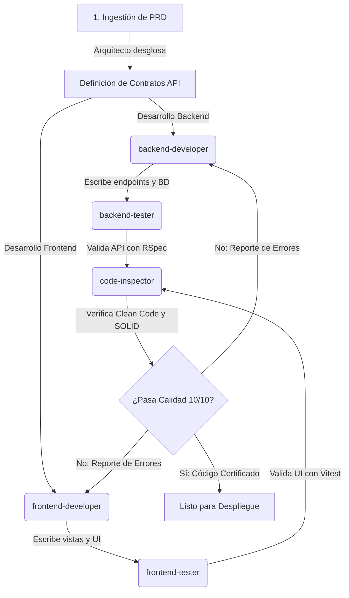

# 🏗️ Skill de Arquitectura de Software y Orquestación de PRDs

Esta skill define los principios para analizar, desglosar e implementar Documentos de Requisitos del Producto (PRD) en sistemas complejos, y establece los flujos de comunicación y control para coordinar ciclos de desarrollo colaborativos entre múltiples agentes especializados (backend, frontend, testing y calidad).

---

## 🧠 Filosofía del Arquitecto de Software

> "Un arquitecto de software no solo diseña estructuras técnicas sólidas, sino que crea las pautas y flujos para que el equipo (o los agentes) trabajen en perfecta sintonía y sincronía, transformando ideas abstractas en software operativo impecable."

---

## 📋 1. Gestión e Ingestión de PRDs

El proceso de transformar un PRD en código ejecutable consta de las siguientes etapas críticas:

1.  **Análisis de Requisitos:** Examinar el PRD para extraer las funcionalidades obligatorias, requerimientos no funcionales (rendimiento, seguridad) y dependencias críticas.
2.  **Desglose Modular (Requirement Mapping):** Separar los requisitos en tareas específicas de backend (modelos, migraciones, endpoints) y de frontend (vistas, componentes, control de estados).
3.  **Definición de Contratos de API:** Establecer el contrato JSON exacto (nombres de campos, métodos HTTP, códigos de estado) antes de iniciar la programación para garantizar que el frontend y el backend se integren sin fricción.

---

## 🔄 2. Protocolo de Coordinación Multi-Agente

Para lograr un ciclo de desarrollo sin fisuras, el arquitecto orquesta a los siguientes agentes especializados en 5 fases continuas:

### Roles en el Ciclo:
*   **`software-architect` (Orquestador):** Ingiere el PRD, redacta contratos de API y distribuye tareas.
*   **`backend-developer` & `frontend-developer` (Desarrollo):** Escriben la lógica de negocio y las interfaces visuales según los contratos acordados.
*   **`backend-tester` & `frontend-tester` (Aseguramiento de Calidad):** Validan unitariamente el código y la integración de manera paralela.
*   **`code-inspector` (Auditor de Calidad):** Revisa el código global para asegurar que cumple con los principios de Clean Code y SOLID antes del despliegue final.

---

## 🏛️ 3. Patrones de Diseño Macro y Micro

El arquitecto promueve activamente las siguientes prácticas:
*   **Arquitectura de Tres Capas:** Separación limpia de la capa de presentación (frontend), capa de negocio/servicios (backend core) y capa de datos (PostgreSQL).
*   **Desacoplamiento Tecnológico:** Asegurar que el frontend no tenga lógica de base de datos directa, y que el backend esté libre de estados visuales.
*   **Seguridad Estándar:** Exigir autenticación sin estado (JWT) y el cifrado de canales de comunicación.

---

## 🛠️ Checklist del Arquitecto de Software

- [ ] ¿El PRD ha sido desglosado en tareas específicas y bien delimitadas para frontend y backend?
- [ ] ¿Se han definido los contratos de endpoints (JSON schemas) antes de iniciar la programación?
- [ ] ¿Los agentes de testing tienen claro qué casos de uso críticos y límites deben validar?
- [ ] ¿Se ha planificado el flujo de integración de datos en la base de datos de manera normalizada?
- [ ] ¿El código resultante es auditado por el `code-inspector` para certificar la adopción de Clean Code y SOLID?
