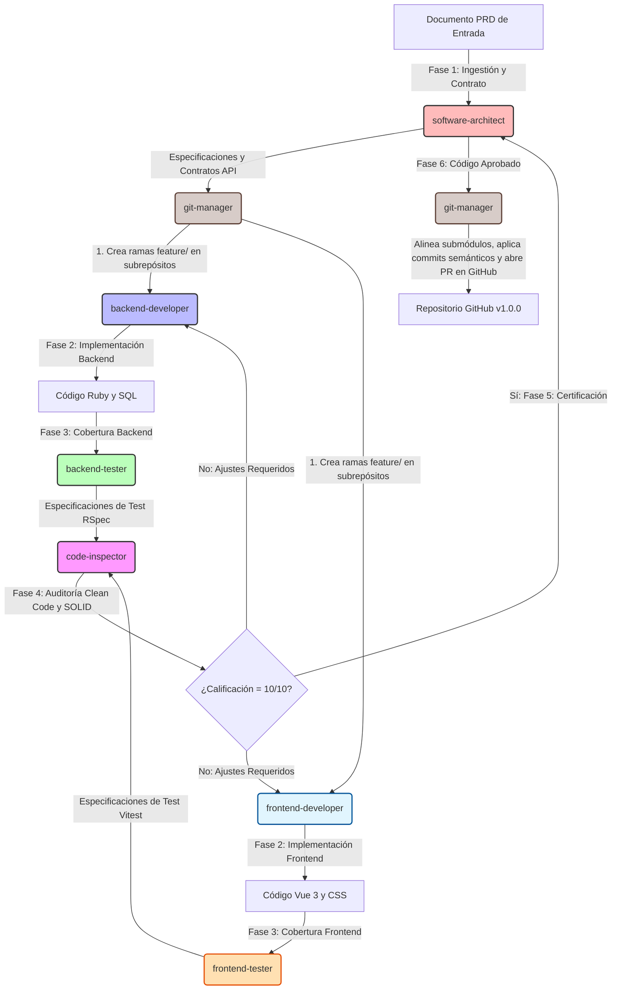

# 🔄 Flujo de Desarrollo Multi-Agente: Proyecto NebriAmazon

Este documento define el **Flujo de Trabajo Colaborativo y Ciclo de Vida del Software** para el equipo de agentes especializados de **NebriAmazon**. Su misión es coordinar esfuerzos de manera secuencial e incremental para convertir Documentos de Requisitos del Producto (PRD) en software de alta calidad, robusto, testeado y libre de deuda técnica (calificación 10/10).

---

## 🗺️ Mapa del Ciclo de Desarrollo

El flujo de desarrollo opera como un bucle cerrado de 6 fases estructuradas, coordinado de principio a fin por el **Software Architect** y gestionado en sus extremos de control de versiones por el **Git Manager**:

---

## 👥 Matriz de Roles y Entregables del Equipo

| Agente | Perfil Técnico | Rol en el Flujo | Entregables Principales |
| :--- | :--- | :--- | :--- |
| **`software-architect`** | Arquitecto Principal | Analizar el PRD, diseñar la arquitectura macro, fijar los contratos API y autorizar despliegues. | Contratos de API (JSON Schemas) y especificación técnica de la tarea. |
| **`git-manager`** | DevOps / Release Manager | Crear ramas de desarrollo, verificar commits semánticos, sincronizar referencias de submódulos y gestionar PRs/Tags en GitHub. | Ramas de características, Pull Requests estructuradas y tags de lanzamiento. |
| **`backend-developer`** | Ingeniero Backend Sr | Implementar lógica de negocio en Ruby (endpoints, controladores, servicios) y modelado relacional en PostgreSQL. | Código fuente Ruby, esquemas y migraciones SQL. |
| **`frontend-developer`** | Ingeniero Frontend Sr | Construir interfaces en Vue 3 y gestionar el estado reactivo con Pinia bajo un diseño responsivo y premium. | Componentes Vue 3, CSS y tiendas Pinia en el directorio cliente. |
| **`backend-tester`** | Ingeniero QA Backend | Diseñar y ejecutar suites de pruebas unitarias y de integración para la API utilizando RSpec y FactoryBot. | Suite de especificaciones RSpec (`*_spec.rb`). |
| **`frontend-tester`** | Ingeniero QA Frontend | Diseñar y ejecutar pruebas unitarias y de componentes utilizando Vitest y Vue Test Utils. | Suite de tests Vitest (`*.spec.js` / `*.test.js`). |
| **`code-inspector`** | Auditor de Software | Analizar estáticamente el código generado contra directrices de Clean Code y principios de arquitectura SOLID. | Reporte de Auditoría (`audit-report.md`) con puntuación global. |

---

## 🚀 Fases Detalladas del Flujo de Trabajo

### 📋 Fase 1: Planificación y Aislamiento de Código (`software-architect` & `git-manager`)
1. **Entrada:** Documento de Requisitos del Producto (PRD) proporcionado por el usuario.
2. **Acción:**
   - El `software-architect` desglosa los requisitos de negocio y define el contrato de API.
   - El `git-manager` toma estas especificaciones, crea las ramas `feature/` de manera paralela en los repositorios de frontend, backend y el proyecto raíz orquestador, asegurando el aislamiento del desarrollo.
3. **Salida:** Ramas de características activas y contratos de API listos.

### 💻 Fase 2: Implementación Paralela (`backend-developer` & `frontend-developer`)
1. **Entrada:** Especificaciones del arquitecto y contratos API de la Fase 1.
2. **Acción:**
   - El `backend-developer` programa los endpoints y controladores en Ruby, junto con las migraciones de base de datos PostgreSQL necesarias.
   - El `frontend-developer` implementa la interfaz interactiva y responsiva en Vue 3 y Pinia consumiendo la API del backend.
3. **Salida:** Código fuente funcional en sus respectivas ramas locales.

### 🧪 Fase 3: Cobertura Funcional y Robustez (`backend-tester` & `frontend-tester`)
1. **Entrada:** Código de desarrollo de la Fase 2.
2. **Acción:**
   - El `backend-tester` escribe especificaciones en RSpec cubriendo caminos felices y de error de API.
   - El `frontend-tester` monta y valida los componentes Vue 3 con Vitest, simulando eventos e interacciones del usuario.
3. **Salida:** Suites de test ejecutadas y aprobadas exitosamente (veredicto Verde).

### 🔍 Fase 4: Auditoría Estática de Calidad (`code-inspector`)
1. **Entrada:** Código implementado (Fase 2) + Suite de tests exitosa (Fase 3).
2. **Acción:** El inspector escanea los archivos buscando desvíos de calidad, code smells y violaciones a SOLID.
3. **Salida:** Reporte de Auditoría con calificación global. Si es inferior a **10.0**, devuelve el código a la Fase 2 para refactorización inmediata.

### 🏁 Fase 5: Certificación de Negocio (`software-architect`)
1. **Entrada:** Código certificado 10/10 por el inspector.
2. **Acción:** El arquitecto realiza una verificación de negocio para confirmar que la funcionalidad desarrollada se alinea con todos los requerimientos planteados en el PRD.
3. **Salida:** Visto bueno de despliegue para la característica.

### 🚀 Fase 6: Empaquetado y Publicación (`git-manager`)
1. **Entrada:** Código aprobado en la Fase 5.
2. **Acción:**
   - El `git-manager` revisa los commits parciales y les da un formato de **Commit Semántico** estructurado.
   - Actualiza la referencia del puntero de los submódulos Git en el repositorio principal orquestador.
   - Sube las ramas a GitHub, abre una Pull Request estructurada y, tras la aprobación del merge, crea una etiqueta de lanzamiento (tag) para la nueva versión de producción.
3. **Salida:** Código fusionado en `main`, submódulos alineados y nueva versión activa en GitHub.

---

## 🏆 Criterios de Aceptación del Software (Definición de Hecho - DoD)

El **Software Architect** e **Git Manager** certificarán la tarea únicamente si se marcan las siguientes casillas:
- [ ] **Funcionalidad:** El software resuelve todos los requisitos obligatorios planteados en el PRD.
- [ ] **Contrato de API:** Los endpoints se adhieren exactamente a la especificación de comunicación diseñada.
- [ ] **Pruebas en Verde:** El 100% de las pruebas en RSpec y Vitest se ejecutan de manera exitosa.
- [ ] **Principios SOLID:** Las clases inyectan dependencias (DIP) y cumplen con la separación de responsabilidades (SRP).
- [ ] **Calidad de Código:** Nota de auditoría emitida por el `code-inspector` de un perfecto 10.0.
- [ ] **Control de Versiones:** Ramas de trabajo fusionadas con Conventional Commits y punteros de submódulos Git sincronizados al 100% en el proyecto raíz.
