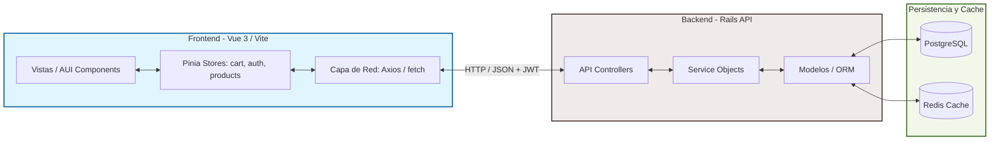
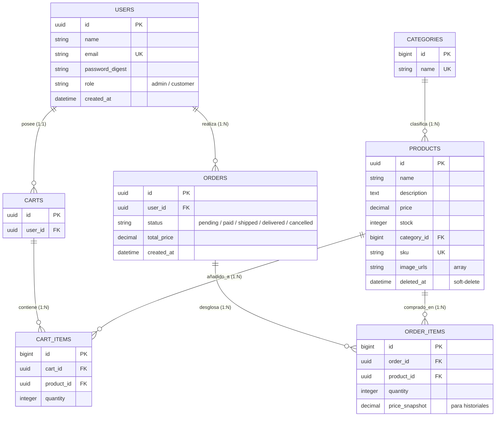
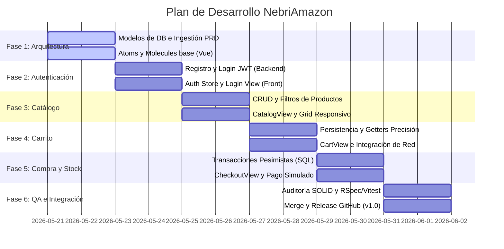

# 🌌 Documento de Requisitos del Producto (PRD) Global: NebriAmazon 🛍️

Este documento representa la **Especificación de Ingeniería Maestra** para **NebriAmazon**, integrando las necesidades del cliente, la arquitectura del sistema, el modelo de datos relacional de PostgreSQL, el diseño atómico de Vue 3, y los contratos de comunicación REST de la API. 

Sirve como **"Fuente de la Verdad"** para guiar a los agentes de software (`software-architect`, `backend-developer`, `frontend-developer`, `backend-tester`, `frontend-tester` y `code-inspector`) durante todo el ciclo de vida del proyecto.

---

## 🏛️ 1. Arquitectura de Integración (Client-Server)

El sistema se estructura en una arquitectura SPA (Single Page Application) desacoplada que se comunica de forma asíncrona mediante JSON a través de una API REST:



---

## 📂 2. Estructura y Estándares de Carpetas

### 📦 Backend (`backend-nebri-amazon/`)
*   **Stack:** Ruby on Rails (API-Only), PostgreSQL, RSpec.
*   **Patrón:** Service Objects para abstraer la lógica de controladores y evitar modelos sobrecargados.

```text
backend-nebri-amazon/
├── app/
│   ├── controllers/      # Controladores REST (JWT Auth, CRUD, Pedidos)
│   ├── models/           # Modelos de ActiveRecord con validaciones estrictas
│   └── services/         # Service Objects (procesadores de compras, stock)
├── db/
│   ├── migrate/          # Migraciones ordenadas y eficientes de PostgreSQL
│   └── schema.rb         # Esquema activo de base de datos
└── spec/                 # Suite de pruebas RSpec (Unitarias e Integración)
```

### 💻 Frontend (`frontend-nebri-amazon/`)
*   **Stack:** Vue 3.5+ (Composition API con `<script setup>`), Pinia, Vite, CSS Vanilla.
*   **Diseño:** Atomic Design para aislamiento y alta cohesión de componentes.

```text
frontend-nebri-amazon/
├── src/
│   ├── assets/           # CSS Vanilla responsivo y variables de color
│   ├── components/
│   │   ├── atoms/        # Componentes base sin estado (BaseButton, BaseInput, BaseBadge)
│   │   ├── molecules/    # Combinación de átomos (ProductCard, CartItem)
│   │   └── organisms/    # Lógica de negocio (AppNavbar, ProductGrid, ChatbotWidget)
│   ├── store/            # Tiendas modulares de Pinia (auth, cart, products)
│   ├── services/         # Peticiones HTTP desacopladas (productService, chatbotService)
│   ├── views/            # Vistas principales de enrutado (Home, Catalog, Detail, Cart, Checkout)
│   └── router/           # Enrutado SPA (Vue Router) con Lazy Loading
```

---

## 🐘 3. Modelo de Datos Relacional (PostgreSQL)

Para garantizar integridad referencial absoluta, transacciones consistentes y un rendimiento óptimo bajo cargas concurrentes:



> [!NOTE]
> Se utilizarán índices (`INDEX`) obligatorios en las claves foráneas y en columnas con búsquedas constantes (como `sku`, `email` y `deleted_at`) para garantizar búsquedas a velocidad constante O(1).

---

## 🔗 4. Contrato de API REST Completo

Todas las respuestas de error utilizarán esquemas estandarizados e informativos con códigos de estado HTTP semánticos:

| Módulo | Método | Endpoint | Roles | Parámetros (JSON Body / Query) | Respuesta Esperada (200/201 OK) |
| :--- | :--- | :--- | :---: | :--- | :--- |
| **Auth** | `POST` | `/api/auth/register` | Todos | `{ name, email, password }` | `{ user: { id, name, email, role }, token }` |
| **Auth** | `POST` | `/api/auth/login` | Todos | `{ email, password }` | `{ user: { id, name, email, role }, token }` |
| **Auth** | `GET` | `/api/auth/me` | Autenticado | *Ninguno* (Header `Bearer Token`) | `{ id, name, email, role }` |
| **Products**| `GET` | `/api/products` | Todos | `?category_id=X&search=Y` | `[ { id, name, price, stock, sku, image_urls } ]` |
| **Products**| `GET` | `/api/products/:id` | Todos | *Ninguno* | `{ id, name, description, price, stock, sku, image_urls }` |
| **Products**| `POST` | `/api/products` | **Admin** | `{ name, description, price, stock, sku, image_urls, category_id }` | `{ id, name, price, stock, sku }` |
| **Products**| `PUT` | `/api/products/:id` | **Admin** | `{ name, price, stock, ... }` | `{ id, name, price, stock }` |
| **Products**| `DELETE`| `/api/products/:id` | **Admin** | *Ninguno* (Soft Delete) | `{ message: "Producto eliminado correctamente" }` |
| **Cart** | `GET` | `/api/cart` | Autenticado | *Ninguno* (Persistido BD) | `{ id, items: [ { id, product, quantity } ] }` |
| **Cart** | `POST` | `/api/cart/items` | Autenticado | `{ product_id, quantity }` | `{ id, quantity, product_id }` |
| **Cart** | `PUT` | `/api/cart/items/:id`| Autenticado | `{ quantity }` | `{ id, quantity }` |
| **Cart** | `DELETE`| `/api/cart/items/:id`| Autenticado | *Ninguno* | `{ message: "Artículo removido del carrito" }` |
| **Orders** | `POST` | `/api/orders` | Autenticado | *Ninguno* (Crea desde Carrito) | `{ id, status: "pending", total_price }` |
| **Orders** | `GET` | `/api/orders` | Autenticado | *Ninguno* | `[ { id, status, total_price, created_at } ]` |
| **Orders** | `GET` | `/api/orders/:id` | Autenticado | *Ninguno* | `{ id, status, total_price, items: [...] }` |
| **Chatbot** | `POST` | `/api/chatbot` | Todos | `{ message }` | `{ reply: "Respuesta textual limpia procesada en backend" }` |

---

## 🛡️ 5. Gestión de Concurrencia y Seguridad Core

### 1. Prevención de Overselling (Venta Excesiva)
Para asegurar que dos clientes no compren la última unidad de un producto al mismo tiempo, el backend implementará un bloqueo pesimista a nivel de base de datos (`SELECT FOR UPDATE`) dentro de una transacción aislada de SQL:

```ruby
# Ejemplo de bloque transaccional atómico
Product.transaction do
  product = Product.lock("FOR UPDATE").find(product_id)
  if product.stock >= requested_quantity
    product.decrement!(:stock, requested_quantity)
    # Generar OrderItem...
  else
    raise ActiveRecord::RecordInvalid, "Stock insuficiente para #{product.name}"
  end
end
```

### 2. Autenticación y Autorización
*   Contraseñas encriptadas mediante hash unidireccional con **Bcrypt** en el backend.
*   Intercambio seguro mediante **JSON Web Tokens (JWT)** firmados. El token se transmitirá en la cabecera `Authorization: Bearer <TOKEN>`.
*   El frontend protegerá las rutas de administración (`/admin`) y compras (`/checkout`, `/cart`) mediante *Navigation Guards* de Vue Router vinculados a la tienda Pinia de autenticación.

---

## 🎨 6. Especificaciones de Diseño e Interfaz (Vue 3 & AUI)

El frontend emulará la estética icónica de Amazon combinada con patrones modernos y premium (micro-animaciones fluidas a 60fps, transiciones responsivas):

### Componentes Base Reutilizables (Atomic Design)
1.  **`BaseButton.vue` (Atomo):** Recibe propiedades para colores primarios (naranja de acento `#FF9900`, azul oscuro de control `#131921`). Si `loading === true`, deshabilita el botón y despliega un loader rotativo dinámico.
2.  **`BaseInput.vue` (Atomo):** Incluye validación reactiva en tiempo real y transiciones de color sutiles en el borde durante el foco del ratón.
3.  **`BaseBadge.vue` (Atomo):** Burbuja de conteo responsiva y flotante con animaciones sutiles tipo "pulse" cuando la cantidad en la cesta de compras cambia.
4.  **`ProductCard.vue` (Molécula):** Tarjeta con imagen del artículo, título, valoración por estrellas reactiva, y llamada a la acción para añadir a la cesta sin salir del catálogo.
5.  **`AppNavbar.vue` (Organismo):** Barra de navegación responsiva y completa, barra de búsqueda en tiempo real, selector de cuenta/roles y acceso dinámico a la cesta.

### Almacenes Globales (Pinia)
*   `auth.js`: Mantiene datos de sesión, persiste el token JWT en memoria y sincroniza perfiles de usuario.
*   `products.js`: Caché del catálogo, gestión del buscador reactivo y filtros de categorías/precios.
*   `cart.js`: Gestión reactiva local (e híbrida asíncrona con el backend al loguearse). Contiene getters matemáticos de alta precisión para el **subtotal**, desgloses del **IVA (21%)** y **total final**. Persiste localmente en `localStorage`.

---

## 🤖 7. Arquitectura Pasiva del Chatbot de Asistencia

Para evitar violaciones a las restricciones de CORS, problemas de rendimiento del navegador y riesgos de seguridad, se descarta el web scraping directo del lado del cliente. El flujo de comunicación se delega limpiamente de la siguiente manera:

```text
[ChatbotWidget.vue] 
       │ (Captura input del usuario)
       ▼
[chatbotService.js] 
       │ (Petición POST asíncrona)
       ▼
[POST /api/chatbot] (Servidor Backend)
       │ (Procesa lógica, consulta DB o servicios IA)
       ▼
[JSON Response] ──► Renderizado pasivo en burbuja de chat
```

---

## 🚀 8. Plan de Implementación de Agentes (Roadmap)

Nuestro gestor de orquestación coordinará el avance del software de forma estrictamente modular y en 6 iteraciones secuenciales:



---

## 🏆 9. Criterios de Aceptación y QA (Definition of Done)

Para considerar cerrado y certificado el proyecto global, se debe verificar y cumplir lo siguiente:
1.  **Backend QA:** Cobertura de pruebas unitarias y de peticiones (Request Specs) con RSpec al 95%. Todas las validaciones de stock concurrente deben pasar con éxito ante hilos paralelos.
2.  **Frontend QA:** Cobertura con Vitest en la lógica de cálculo financiero de `cart.js`. Simulación de interacciones DOM sin warnings en consola.
3.  **Accesibilidad:** Cumplimiento nativo con la directiva **WCAG 2.1 AA** verificado por contraste de pantalla y lectura semántica.
4.  **Calidad Estructural:** Auditoría obligatoria de nuestro agente `code-inspector`, certificando cero acoplamiento, alta cohesión y puntuación de 10.0 en Clean Code.
