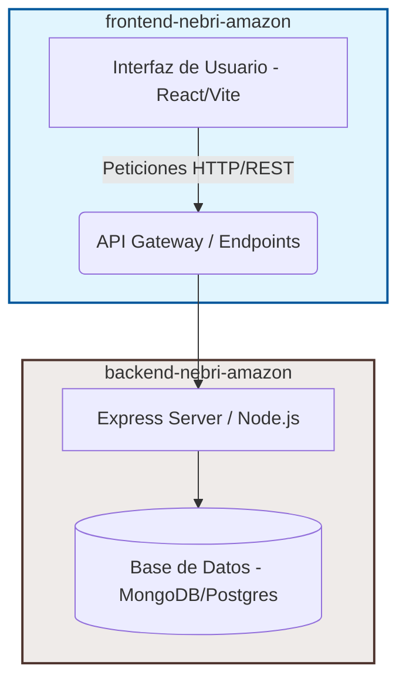

# 🌌 Proyecto NebriAmazon 🛍️

[](#)
[](#)
[](https://www.nebrija.com/)

Bienvenido al repositorio principal de **NebriAmazon**, una simulación completa de la plataforma de comercio electrónico Amazon, desarrollada como proyecto académico para la **Universidad Nebrija**.

Este repositorio actúa como el **orquestador central** del proyecto y agrupa los dos componentes esenciales a través de submódulos de Git: el frontend interactivo y la API del backend.

---

## 🏛️ Arquitectura del Proyecto

El sistema está dividido en dos submódulos independientes pero perfectamente integrados:



*   **[💻 Frontend (React/Vite)](./frontend-nebri-amazon)**: La aplicación web del cliente que proporciona una interfaz interactiva, dinámica y responsiva para los compradores.
*   **[📦 Backend (Node.js/Express)](./backend-nebri-amazon)**: La API que proporciona los servicios de autenticación, gestión del catálogo, carrito de compras y persistencia de datos.

---

## 🚀 Guía de Clonación y Configuración Inicial

Dado que el proyecto utiliza **submódulos de Git**, se deben seguir instrucciones específicas para obtener todo el código fuente correctamente:

### 1. Clonar el repositorio principal junto a sus submódulos

Para clonar este repositorio incluyendo automáticamente todos los submódulos configurados, ejecuta:

```bash
git clone --recursive https://github.com/AlvaroPaniego/ProyectoNebriAmazon.git
```

*Nota: Si ya clonaste el repositorio sin el parámetro `--recursive`, puedes inicializar y descargar los submódulos ejecutando:*

```bash
git submodule update --init --recursive
```

---

## 🛠️ Cómo Iniciar el Entorno de Desarrollo

Para poner en marcha la aplicación completa localmente, debes levantar ambos servicios:

### Paso 1: Configurar y arrancar el Backend
1. Entra al directorio del backend:
   ```bash
   cd backend-nebri-amazon
   ```
2. Instala las dependencias y crea el archivo `.env` configurando tu base de datos:
   ```bash
   npm install
   ```
3. Inicia el servidor de desarrollo:
   ```bash
   npm run dev
   ```

### Paso 2: Configurar y arrancar el Frontend
1. En una nueva terminal, entra al directorio del frontend:
   ```bash
   cd frontend-nebri-amazon
   ```
2. Instala las dependencias:
   ```bash
   npm install
   ```
3. Inicia el servidor cliente de Vite:
   ```bash
   npm run dev
   ```

La aplicación frontend estará accesible normalmente en `http://localhost:5173` y se conectará al servidor backend que corre en `http://localhost:5000`.

---

## 📂 Repositorios de los Submódulos

Puedes acceder directamente a los repositorios independientes de cada componente aquí:
*   🔗 **Backend:** [AlvaroPaniego/backend-nebri-amazon](https://github.com/AlvaroPaniego/backend-nebri-amazon)
*   🔗 **Frontend:** [AlvaroPaniego/frontend-nebri-amazon](https://github.com/AlvaroPaniego/frontend-nebri-amazon)

---

## 🎓 Autores y Desarrollo

Proyecto desarrollado como parte de la formación académica en Ingeniería Informática / Desarrollo de Software en la **Universidad Nebrija**.
